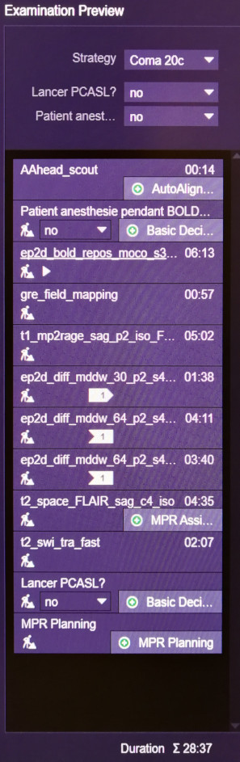

# GIGA-Consciousness MRI Protocol

A clinical and research 3T MRI protocol under 30 minutes, as presented at [CME2019](https://cme2019.ifado.de) in Dortmund.

Version: 1.1.3 - 2020-03-09

## Description

Magnetic Resonance Imagery is a highly flexible tool that can acquire a lot of different contrasts, from structural anatomy and connectivity, to functional connectivity and blood flow. This technology allows both the investigation of brain processes as well as clinical assessment of lesions.

A major issue is that MRI analytic studies often suffer from small sample size and underpowered effects. One way is to attempt to use more specific, better tailored methods to compensate for the low sample size, adding more assumptions in exchange. Another way is to simply acquire more subjects, which is not a trivial task.

Indeed, MRI is very expensive, particularly when the machine is not dedicated to research, such as hospitals' MRI machines. Often, the MRI protocol used on such machines is of subpar quality or technology, to stay in the time bounds of a clinical acquisition. Indeed, there are more patients than time allows, so that hospitals are perpetually looking for ways to reduce acquisition times. On top of that, for populations of patients prone to motion, usually about 2/3rd will not be processable by computational methods.

Reducing the acquisition time is often thought as a limitation, but it can be an opportunity: this allows for more subjects to be acquired in the same timeframe thus increasing the sample size; for patients populations that are prone to motion, having faster sequences allows to reduce the impact of the motion artifacts and the need to sedate; and finally, a fast protocol is more reusable across studies, which is ideal to build cross-sectional datasets of different patients typologies.

This repository contains the protocol of a 30 minutes 3T MRI for the Siemens Magnetom Vida machine, including the following sequences:

- T1 FLAWS (automatically segmented MPRAGE, voxel-size: 1mm³ isotropic)
- Sub-second EPI BOLD (TR: 758 ms, voxel-size: 3mm³ isotropic)
- Multi-shell DWI/DTI (3-shells: b700, b1000, b2000)
- Clinical sequences: FLAIR, SWI, SWI/mIP, PCASL & Proton Density map

Screenshot of the protocol and total acquisition time, on the left without PC-ASL nor Proton Density map, on the right with both enabled:

The main innovations of this protocol are:

* a curated combination of cutting-edge sequences (sub-second EPI BOLD, multi-shell DTI, T1 FLAWS) to cover most experimental and clinical needs.
* speed optimizations with a good quality balance. Most sequences here are the fastest of all current 3T MRI literature (Multi-shell DTI at 13min, T1 FLAWS in 5min, FLAIR in 3min, SWI in 3min, etc).
* reduced susceptibility to motion and metal/chemical artefacts.

This protocol was designed over the span of 8 months and is now a standard protocol at the Hospital of Liège, Belgium. So far, 45 subjects (18 healthy volunteers, 17 disorders of consciousness patients, 10 subjects of other studies) have been acquired using this protocol.

For more details, please consult the [CME2019 slides](https://github.com/lrq3000/mri_protocol/blob/master/ICME2019-stephen-karl-larroque.pdf). For detailed technical informations and bibliography, please consult [ComplementaryInfosBiblio.md](https://github.com/lrq3000/mri_protocol/blob/master/ComplementaryInfosBiblio.md). The protocol can be adapted to other machines by using the [pdf printout](https://github.com/lrq3000/mri_protocol/blob/master/SiemensVidaProtocol/Coma%20Science%20Group.pdf) (see next section). In an effort to promote transparent open research, the lab notes written along the construction of this protocol are available in the [Notes folder](https://github.com/lrq3000/mri_protocol/tree/master/Notes) (beware, it's very messy, but there's lot of additional infos and references).

A sample MRI acquisition with this protocol can be [downloaded on FigShare](https://figshare.com/articles/dataset/non24-mri/14384843), which can be viewed with a Dicom viewer such as [RadiAnt Dicom Viewer](https://www.radiantviewer.com/) (tip: unzip the archive for the BOLD and DWI sequences to properly be displayed as 4D sequences instead of separate 3D sequences).

## How to install

If you own a 3T Siemens Magnetom Vida, the full protocol can be directly imported into your machine by using the [exar1 file](https://github.com/lrq3000/mri_protocol/blob/master/SiemensVidaProtocol/Coma%20Science%20Group%2052.exar1).

Otherwise, for another machine, the [pdf printout](https://github.com/lrq3000/mri_protocol/blob/master/SiemensVidaProtocol/Coma%20Science%20Group.pdf) or [xml printout](https://github.com/lrq3000/mri_protocol/blob/master/SiemensVidaProtocol/Coma%20Science%20Group.pdf) details most parameters (but unfortunately not all, but at least the most important ones) in a human readable format. By using these printouts as a reference, the protocol should be implementable on pretty much any machine, with only basic access to the standard parameters fields (ie, no need for experimental parameters access nor developer console, see the FAQ below for more details).

To use these printouts: only the first 12 sequences are part of the final protocol (up to pcasl and proton density map included), the rest being test sequences that, for most, do work but were not kept in the final protocol (but feel free to try them out if you are interested). Note also that EPI BOLD and PCASL are duplicated with a different name depending on the patient state (sedated or not), but otherwise all the parameters are the same, so you can keep only one if you are not working with potentially sedated patients.

In order for this protocol to run under 30 minutes, a multiband (Simultaneous Multi-Slices -- SMS for Siemens) license is necessary to activate this technology to reduce the acquisition time of EPI BOLD and Multi-shell DWI. For other sequences, the multiband is not necessary, as only parallel imaging (GRAPPA) and careful tweaking of the pulse parameters are used to accelerate the acquisition.

Meta-protocol wise, a screenshot of the protocol programming can be found in the SiemensVidaProtocol folder. The protocol programming was designed to ensure that:

1. the EPI BOLD sequence is run first (just after the localizer), to ensure the patient is still awake and lesser stressed (and thus reduce the risks of motion and sedation).
2. the multi-shells of DTI acquisition are run using the same coil positioning parameters (on Siemens, use a Copy Reference from the first to the second and third shells).
3. the sequences are renamed depending on the patient's state (ie, sedated or not), which allows an auto-documentation of how the acquisition went, directly stored inside the DICOMs.

We also strongly advise the use of a 3D head immobilizer (we use the [Pearltec Multipad](http://pearl-technology.ch/en/radiology/multipad) which allows for flexible positioning), as to further reduce motion and the need for sedation.

## Authors & citations

This protocol was thought and programmed by Stephen Karl Larroque. Subjects were acquired by Manon Carrière, Charlotte Martial and Stephen Karl Larroque. The project was supervised by Steven Laureys. All authors are from the University of Liège, Belgium. Stephen Karl Larroque is a doctoral student with a F.R.S.-F.N.R.S. ASP grant, Steven Laureys a research director at F.R.S.-F.N.R.S.

We are thankful to Jean-Marc Léonard from Siemens Healthineers and Gauthier Kempinaire for their precious support in programming adequately the machine, to Jean-Flory Tshibanda, Nathalie Maquet and the Radiodiagnostic team for their collaboration, and Pearltec for their partnership and providing us with a 3D head immobilizer (Multipad).

If you find this work useful, please cite it as follows:

  Larroque, S. K., Carrière, M., Martial, C., & Laureys, S. (2019). A clinical and research 3T MRI protocol under 30 minutes. 23 September 2019. 13th CME International Conference on Complex Medical Engineering. http://hdl.handle.net/2268/240633

## Frequently Asked Questions

### What is the target version?

The exar1 file should work with the software version introduced with the Siemens Vida, which is VB30 (previous versions on the VIDA had issues with DTI reconstruction). The Dot Cockpit version used is a minor update from [syngo MR E11](http://cbbi.udel.edu/wp-content/uploads/2017/01/Dot_Cockpit.pdf).

For other versions, the sequences can be reproduced using the [printouts](https://github.com/lrq3000/mri_protocol/blob/master/SiemensVidaProtocol/Coma%20Science%20Group.pdf). Unfortunately, the printouts do not display all parameters, hence the protocol will be incomplete if implemented with printouts. For example, Prescan Normalize ([bias field map correction for phased array receive coil heterogeneity](https://practicalfmri.blogspot.com/2012/04/common-persistent-epi-artifacts-receive.html)) needs to be activated on both the EPI BOLD and DWI sequences, as it improves the signal-to-noise ratio of subcortical structure especially for [multiband EPI](https://practicalfmri.blogspot.com/2016/02/starting-points-for-sms-epi-at-3-t.html) and also [improves coregistration to the anatomical image](http://dx.doi.org/10.1016/j.neuroimage.2012.10.076), which is of paramount importance and very prone to algorithmic errors for heavily brain damaged patients. [Prescan Normalize for DWI should be fine according to the MRTRIX3 developers](https://community.mrtrix.org/t/use-of-prescan-normalize-siemens-and-dwidenoise/1666/2).

### Do I need the multiband license?

Multiband is necessary for sub-second BOLD and multiband DTI, but not for the rest (eg, FLAWS, requires only MP2RAGE and parallel imaging such as GRAPPA or SENSE).

To get this license, two ways are possible:

* Buy the Siemens SMS license. SMS is based on the CMRR's multiband sequence, it thus has most of the same features with the exception of the newest features that might take more time to be merged in (Siemens waiting for them to be stable) and also some advanced parameters are not available (at least not without developers access). The list of supported machine is listed [here under General Requirements](https://www.siemens-healthineers.com/magnetic-resonance-imaging/options-and-upgrades/clinical-applications/simultaneous-multi-slice).
* And and fill a C2P partnership form with the [CMRR](https://www.cmrr.umn.edu/multiband/) (University of Minnesota), the original authors of the multiband technology. This is an opensource protocol, also used by the [Human Connectome Project (HCP)](http://protocols.humanconnectome.org/CCF/) with more cutting-edge features. Note that the CMRR's protocol supports different machines than Siemens', so it might be interesting to check it out if the SMS license is not supported.

In case you can't have the multiband, it's better to stick to BOLD TR 2s and DTI single-shell b1000 to keep the protocol under a reasonable time constraint.

Also, although multiband is a great speedup, this is not the only optimization that can be done. We would strongly advise to focus efforts on acquiring a 3D head immobilizer, which costs around 2000 euros, but is very worth given the reduction in motion noise and sedation.

### Who owns the rights?

As far as we know, we are the rights owner for this protocol, which is herein distributed under the MIT License.

Technically, all sequences of our protocol stem from base sequences provided by Siemens and modified to fit our needs. This was necessary as we do not have access to the full parametrization of the machine, which is only allowed to trained specialists. For instance, the FLAWS sequence can be recreated by modifying the parameters of the base MP2RAGE sequence.

As such, all sequences should be reproducible on any machine since we modified only "standard" parameters such as inversion time, bandwidth, flip angle, etc. and not any experimental parameter or developer console commands that would be accessible only to trained specialists.

For multiband, the various names used by the different MRI brands can be found on [mriquestions](http://mriquestions.com/simultaneous-slices.html).

### How can I implement T1 FLAWS from the printout?

To implement T1 FLAWS, you should start from the Siemens native MP2RAGE sequence, and then modify its TI1 and TI2 parameters to the values in the printout. If the TI1 and TI2 parameters can't be lowered enough, play with slice fourier interpolation and plane fourier interpolation. In our case, 7/8 was enough to attain 450 TI1 and 1350 TI2 (with slice fourier 6/8 we can go much lower).

If your machine does not support MP2RAGE, an alternative to FLAWS is FLAIR(2), a combination of FLAIR and T2: FLAIR2 = 3D-FLAIR .* 3D-T2 ; Contrary to FLAWS the images are not necessarily coregistered but it offers CSF nullification and increased WM vs GM contrast compared to DIR (double inversion recovery): Wiggermann, V., Hernandez-Torres, E., Traboulsee, A., Li, D. K. B., & Rauscher, A. (2016). FLAIR2: a combination of FLAIR and T2 for improved MS lesion detection. *American Journal of Neuroradiology*, *37*(2), 259-265.

### I need help with reconstructing the protocol from the printout

Here are some resources that can help you:

* [syngo MR E11 Dot Cockpit manual](http://cbbi.udel.edu/wp-content/uploads/2017/01/Dot_Cockpit.pdf) (in particular the Copy Reference option is described)

* [syngo MR E11 System and data management](http://cbbi.udel.edu/wp-content/uploads/2017/01/Sys-DataManagement.pdf) which is a complementary manual to the Dot Cockpit.

* [Harvard's Center for Brain Science - Operating the scanner FAQ](http://cbs.fas.harvard.edu/science/core-facilities/neuroimaging/information-investigators/scannerfaq) which explains how to operate the MRI machine (on an older syngo version but it's similar), and in particular how to check for errors in the console and how to save the log to send to Siemens Healthineers.

* [syngo MR E11 Neuro operator manual](http://cbbi.udel.edu/wp-content/uploads/2017/01/Neuro.pdf)

### Which coil should be used?

The protocol was designed for the 20 channels coil provided with the Siemens Vida. We also attempted to use the 64 channels coil, but the headset was too small for our patients population with spastic behavior, thus needing more space to fit their head around their neck as they often do not lay their head straight.

However, we initially maintained the protocol with both coils, so that this protocol can in fact rather easily be converted to a 64 channels coil. Most parameters can be set as exactly the same and just change the coil used from 20c to 64c in the Siemens syngo interface.

Beware however that although 64 channels coils provide a significant boost in SNR in the cortical areas, the wavelength is actually smaller and thus has a harder time penetrating through to subcortical areas. So if you are also interested in subcortical areas, you might want to stick with the 20c coil.

If you want to use a 64 channels coil, we recommend enabling Prescan Normalize for both the EPI BOLD and DWI sequences, as this will have a [greater receive coil heterogeneity](https://practicalfmri.blogspot.com/2013/07/12-channel-versus-32-channel-head-coils.html) than 20 channels coil, and hence a bias field map correction is necessary as is done with Prescan Normalize. This can easily be observed when comparing a 20c scan and a 64c scan side-by-side: the 64c image will have very bright pixels in cortical areas, but very dimmed subcortical areas (ie, the center of the brain is "black-outed"). This is because 64c coils use shorter waves that do not travel as far as their 20c counterparts. Furthermore, the fact that we use [multiband EPI worsen the issue, with Prescan Normalize being recommended as a solution here too](https://practicalfmri.blogspot.com/2016/02/starting-points-for-sms-epi-at-3-t.html). If you fear losing information by enabling Prescan Normalize, it's possible to save both the normalized and raw time series by enabling the "Unfiltered Images" option in the advanced options of Prescan Normalize, with no computation nor acquisition time cost as these images will be saved in parallel in a dual stream (note however that it's impossible to enable "Unfiltered Images" in another option at the same time, as the dual stream can only save two streams of images, so dual stream can only be enabled for one option on the whole sequence - for example "Distortion correction" also allows "Unfiltered Images" aka dual stream, but if you enable it too alongside dual stream for Prescan Normalize, only one of those will be saved without any obvious error message, or the acquisition may even crash). Although the improvements of Prescan Normalize / bias fieldmap are not yet formally demonstrated, [there is increasing evidence it should be used for EPI BOLD (fMRI) if a phased array coil is used for reception](https://practicalfmri.blogspot.com/2012/04/common-persistent-epi-artifacts-receive.html), and [some experienced MRI researchers often recommend it](https://neurostars.org/t/advice-for-optimizing-subcortical-signal-with-phased-array-head-coils/1504/4), as the difference is quite glaring even just visually. Furthermore, and likely more importantly for studies with brain damaged patients, Prescan Normalize [improves coregistration to the anatomical image](http://dx.doi.org/10.1016/j.neuroimage.2012.10.076), which is of paramount importance and very prone to algorithmic errors for heavily brain damaged patients. Prescan Normalize may also [improve motion correction](https://practicalfmri.blogspot.com/2012/11/review-using-bias-field-map-to-improve.html). [Prescan Normalize for DWI should be fine according to the MRTRIX3 developers](https://community.mrtrix.org/t/use-of-prescan-normalize-siemens-and-dwidenoise/1666/2).

For the difference between 20 channel and 64 channel coils, this paper might be of interest: Seidel, P., Levine, S. M., Tahedl, M., & Schwarzbach, J. V. (2019). Temporal signal-to-noise changes in combined multiband-and slice-accelerated echo-planar imaging with a 20-and 64-channel coil. *BioRxiv*, 641902.

### What instructions do you give to the patient undergoing MRI scanning?

As soon as the patient is set inside the machine (with the 3D inflatable pillows for immobilization and ear plugs plus headphones to protect their audition), we ask if they are feeling comfortable enough (else we may have to deflate a bit the pillows or adjust the back/knees pillows or add a blanket for the legs or adjust other things). We then instruct them to remain as still as possible for the whole acquisition, which lasts about 30 min, and to wait when the machine stops making noises, or when the operator starts to talk again between sequences, to move if they need to reposition themselves for comfort (do NOT underestimate this instruction, it is highly important for the patient to be able to reposition themselves for comfort, and if they are not properly instructed, they will move during the sequences, thus creating motion artifacts!). Of course, this means that between every few sequences, the operator should mark a pause, and ask the patient how they are feeling (talking with the patient regularly also reduces potential feelings of claustrophobia).

Since the first sequence is BOLD (fMRI), we then instruct them to let their thoughts flow without stopping on any in particular, with their eyes closed and while staying awake, for the next 6-10 minutes (depending on how long you set your BOLD sequence). This lasts for less than 10 minutes, after which the protocol switches to structural sequences where the patient does not need to control their thoughts anymore.

At this point, if the patient is conscious, we tell them that they can sleep if they want for the remainder of the acquisition, as sleep should not change structural images. Again, we remind them to wait when the machine stops making noises to reposition themselves if they need to, but otherwise to remain as still as possible as this accelerates the acquisition (ie, we don't need to reacquire the images twice because of motion artifacts).

If they are not conscious, the patient can be sedated after the first BOLD in order to minimize motion if this is necessary. Sedation should not impact structural images, so for analysis, sedation from this stage of the protocol does not change anything technically, but of course sedation should be avoided as much as possible for the comfort (and risk reduction) of the patient.

### I can't find the FLAIR sequence on my machine!

If you are trying to reproduce the protocol from the printout, and thus search for native sequences from which to start tweaking to the same parameters of our printout, you will find that the FLAIR sequence is not available on Siemens machines. Instead, look for "dark fluid" sequences, which are exactly the same but have been renamed because of copyright issues on the name FLAIR. For more informations about the FLAIR/dark fluid sequence, please read the seminal paper: Hori, M., Okubo, T., Uozumi, K., Ishigame, K., Kumagai, H., & Araki, T. (2003). T1-weighted fluid-attenuated inversion recovery at low field strength: a viable alternative for T1-weighted intracranial imaging. *American journal of neuroradiology*, *24*(4), 648-651.

### Are the sequences useable for analysis?

Theoretically, all sequences are usable for analysis, and are based mostly on already published protocols. We ourselves ran several subject-level and group-level analyses on the structural MP2RAGE FLAWS, diffusion weighted imaging, and the fMRI BOLD timeseries. Most of these work with standard processing pipelines out-of-the-box such as SPM12, although some parameters should be avoided or tweaked (eg, slice timing correction and motion correction should account for multiband in dMRI and fMRI). We have released our preprocessing and analysis pipelines for these 3 sequences as implemented in this protocol, at [https://github.com/lrq3000/csg_mri_pipelines](https://github.com/lrq3000/csg_mri_pipelines).

Please note however that pcASL is experimental, it is still useful in any case as a clinical tool, but we did not run any analysis on it (see the next section for more details).

### How to properly place the Pearltec MultiPad pillows to reduce motion?

This is a question we often get asked, and depending on how the pads are placed, they can either be the best tool to reduce motion, or very inefficient. We have tested on a dozen of controls and as many patients, all with great results when pads were placed in a specific way. Here is a schema:

MultiPad placement without MRI head coil:

MultiPad placement with MRI head coil:

The idea is to first place the 2 (deflated) lateral pads on the cheeks of the subject, not on the ears, because it's very uncomfortable to combine these pads with headphones, and also because we have found that their greatest effect on motion is when the are placed not entirely on the sides of the head but on the sides of the face.

Then, the forehead 3rd pad (named "bendy" by Pearltec) is placed **on top** of the lateral pads, so that both ends of the forehead pad overlaps and rests on the lateral pads. In other words, the forehead pad may not even touch the subject's forehead.

All the pads can be modified to have their own inflation pump, but we chose to keep the 2 lateral pads with their own pump (because usually we want both pads to have the same inflation in a symmetrical fashion), and the forehead pad has its own separate pump.

Finally, the MRI head coil is placed, and the pads are inflated: first, the lateral pads, then the forehead pad. During the inflation, we regularly ask the subject to try to move their head from side to side (as if they were nodding a "no") during the inflation of the 2 lateral pads, and then up and down (as if they were nodding a "yes") during the inflation of the forehead pad to fill up the remaining gap between the forehead and the head coil. When both of these motions are almost impossible for the subject to perform, usually when the pads are inflated enough so that they fill the gap between the subject's face and the MRI head coil's interior, and if the subject is also feeling comfortable enough (we ask if there is not too much pression, if yes we deflate and readjust by reinflating less but just as necessary), then the pillow placement is done and we can proceed with the acquisition.

Note that **none of the pads should ever overlap with the eyes or the mouth**. If the subject cannot control themselves, or do not feel comfortable with the pads (eg, if they increase the subject's claustrophobia), then remove the pads and do not use them. The subject should always feel comfortable with the pad. One advantage in terms of comfort (despite the slight pression on the cheeks) for the subject is that they do not need to concentrate as much to stay still as when there is no pillow, because the pillows are restricting their movement, so they have a "guide" to stay still and we have several subjects reporting to us that it helped them feel more comfortable.

(Original image credit: [OpenClipart-Vectors](https://pixabay.com/fr/vectors/l-homme-personne-avatar-visage-156584/))

### Update on pcASL

We implemented the pcASL right away when it rolled out of Siemens beta phase. Before, we implemented the standard Siemens pASL (3D-GRASE with PASL-FAIR (Q2TIPS), Perfusion Mode: FAIR QII, more information [here](https://www.healthcare.siemens.com/magnetic-resonance-imaging/options-and-upgrades/clinical-applications/asl) and [here](http://s434060124.online.de/aslindementiacms/basic-principles-of-asl-2)). We thus did not have much time to test it out, and ran no analysis, except for visual assessments by neurologists of the clinical pertinence.

Since then, it has come to our attention that tentative recommendations are available, although ASL is still a young modality and thus recommendations can change in the future. In particular, this one:

Alsop DC, Detre JA, Golay X, et al. Recommended implementation of arterial spin-labeled perfusion MRI for clinical applications: A consensus of the ISMRM perfusion study group and the European consortium for ASL in dementia. Magn Reson Med. 2015;73(1):102–116. doi:10.1002/mrm.25197

The authors there recommend that **pcASL should be acquired alongside a proton density map**, as to allow for the derivation of absolute values. No proton density map was initially acquired in this protocol by default, but the protocol is now updated since v1.1.0 to acquire a proton density map just after the PC-ASL. This extends the total acquisition time by 2 additional minutes, totalling 33min and 2 seconds. As the authors describe, a proton density map can reduce the noise, which we feel is akin to using fieldmaps for dMRI and fMRI, so it's likely not necessary, but this is still strongly advised to conduct proper computational analyses with as little bias as possible.

Also there exists a SPM12 toolbox for ASL analysis, including perfusion maps, named ASLtbx:

Wang Z, Aguirre GK, Rao H, et al. Empirical optimization of ASL data analysis using an ASL data processing toolbox: ASLtbx. Magn Reson Imaging. 2008;26(2):261–269. doi:10.1016/j.mri.2007.07.003

ASLtbx can be downloaded [here](https://cfn.upenn.edu/~zewang/ASLtbx.php).

### I can't find the SWI-mIP images!

#### How to restore the SWI and SWI-mIP acquisition on the machine

If after an acquisition you get only two SWI sequences (t2_swi_tra_p2s2_ir_2mm Magnitude and Phase, instead of 4), then you ran into a known issue with the new Siemens VIDA machine with 3D distortion. Indeed, it is currently not possible to enable 3D distortion correction along with acquiring Mag/Pha and SWI, this will only produce the Magnitude and Phase images, but not the SWI. To fix this, simply disable 3D distortion correction (by switching to 2D distortion correction), then both Mag/Pha reconstruction and SWI can be enabled and acquired. This will be fixed in the next version of this protocol after the coronavirus crisis.

For now, the protocol uses the t2_swi_tra_fast native sequence, which is both very fast (2 min only) and support 3D SWI and SWI-mIP reconstructions, but without the phase.

If you run into other issues or want to try to reconstruct the SWI manually (or use new methods). But without the phase image, it's impossible to reconstruct manually using SWI.jl nor use more advanced methods like vesselnets. If you would like to use these methods, prefer to use the sequence t2_swi_tra_p2s2_ir_2mm or t2_swi_tra_p3_ir_2mm that also are available as optional sequences in this protocol, just make sure to disable 3D distortion correction (by switching back to 2D distortion correction).

Additional notes on how to rebuild this sequence (if a future update breaks it):

* This sequence is simply a copy of the Siemens sequence of almost the same name, but with multiband (parallel) acceleration activated and set to a factor of 2. Additionally but optionally, interpolation can be enabled to slightly increase the resolution, without changing the acquisition time. By remaking the sequence, the SWI and SWI-mIP should be generated again (until the next Siemens update, except if they fix the bug). A few options need to be set to specific values to enable the SWI reconstruction:
  
  * set Acceleration Factor 3D to 1, not any higher value, as the VIDA does not yet support reconstruction of multiband SWI (but note that the Mag/Pha images will still be acquired with acceleration and you can reconstruct them using SWI.jl below). This will be fixed in a future update of the VIDA according to our infos from Siemens Healthineers.
    
  
  * Enable the SWI checkbox, and select Reconstruction: Magnitude (not Phase)
    
  
  * Select Mag/Pha as the reconstruction method.
  
  * Leave the distortion correction to 2D, do not select 3D, else the SWI will not be acquired (even if the SWI checkbox is still checked). If you want 3D distortion correction, you must select only Magnitude as the reconstruction method, without the Phase. But note that without the phase, it will be impossible to manually to use SWI.jl and other advanced reconstruction methods on computer to manually reconstruct SWI or vesselnets.

#### How to reconstruct the SWI and SWI-mIP manually from the raw magnitude and phase images

This solution is interesting if you have already acquired several subjects without noticing the bug, as this allows you to recover the SWI without running another acquisition on the subject. This approach may also be more interesting to normalize the post-processing pipeline for computational analysis purposes (see below). Note however that the reconstruction may differ from what your MRI machine vendor does (so the images may look a bit different - for better or worse).

Here is how to do that:

* You can use the excellent opensource [SWI.jl package](https://github.com/korbinian90/SWI.jl) in Julia, by Korbinian Eckstein, which does all the work for you. Note for future readers: the [main developer stated](https://github.com/korbinian90/SWI.jl/pull/3#issuecomment-591408758) the package will be renamed to CLEAR-SWI and be moved to [MriResearchTools.jl](https://github.com/korbinian90/MriResearchTools.jl). We also invite you to follow [Eckstein's other works](https://github.com/korbinian90), all around making MRI reconstruction better with opensource software implementations, such as an impressive [magnitude intensity correction for 7T MRI](https://github.com/korbinian90/Magnitude-Intensity-Correction), a [MRI library for Julia including NIfTI handling](https://github.com/korbinian90/MRI.jl), a [fast 3D phase unwrapping](https://github.com/korbinian90/ROMEO.jl) and a [bipolar distortion correction](https://github.com/korbinian90/Bipolar-Distortion-Correction).
* Or you can use [FSL PRELUDE](https://fsl.fmrib.ox.ac.uk/fsl/fslwiki/FUGUE/Guide#PRELUDE_.28phase_unwrapping.29) which has [the best phase unwrapping method](https://www.ncbi.nlm.nih.gov/pmc/articles/PMC4059792/), to generate a filtered phase image, and from there it's straightforward to compute the SWI and SWI-mIP manually by applying the filtered phase image on the SWI and doing the mIP calculation. Here are some references that may help you in this process:
  * [Making an SW image](http://mriquestions.com/making-an-sw-image.html), mriquestions.com
  * Haacke, E. M., Mittal, S., Wu, Z., Neelavalli, J., & Cheng, Y. C. (2009). [Susceptibility-weighted imaging: technical aspects and clinical applications, part 1](http://www.ajnr.org/content/30/1/19). American Journal of Neuroradiology, 30(1), 19-30.
  * Li, N., Wang, W. T., Sati, P., Pham, D. L., & Butman, J. A. (2014). [Quantitative assessment of susceptibility‐weighted imaging processing methods](https://www.ncbi.nlm.nih.gov/pmc/articles/PMC4059792/). Journal of Magnetic Resonance Imaging, 40(6), 1463-1473.
  * Seminal paper: Wang, Y., Yu, Y., Li, D., Bae, K. T., Brown, J. J., Lin, W., & Haacke, E. M. (2000). [Artery and vein separation using susceptibility‐dependent phase in contrast‐enhanced MRA](https://onlinelibrary.wiley.com/doi/full/10.1002/1522-2586%28200011%2912%3A5%3C661%3A%3AAID-JMRI2%3E3.0.CO%3B2-L). Journal of Magnetic Resonance Imaging, 12(5), 661-670.
  * An example pipeline using FSL PRELUDE for pre-processing and freesurfer for the rest can be found here: https://github.com/ksubramz/SWI_Processing

Here are a few tutorials on how to clinically interpret SWI images:

* Sahin, Neslin & Solak, Aynur & Genç, Berhan & Bilgiç, Nalan. (2014). [Susceptibility-Weighted MR Imaging: Added value of susceptibility signals in diagnosis of hemorrhagic lesions of the brain](https://www.researchgate.net/publication/290504845_Susceptibility-Weighted_MR_Imaging_Added_value_of_susceptibility_signals_in_diagnosis_of_hemorrhagic_lesions_of_the_brain). Turkish Journal of Cerebrovascular Diseases. 20. 77-86. 10.5505/tbdhd.2014.66588.
* Haacke, E. M., Mittal, S., Wu, Z., Neelavalli, J., & Cheng, Y. C. (2009). [Susceptibility-weighted imaging: technical aspects and clinical applications, part 1](https://www.ncbi.nlm.nih.gov/pmc/articles/PMC3805391/#S8title). American Journal of Neuroradiology, 30(1), 19-30. Section: "Interpreting SWI Data".
* Robinson, R., & Bhuta, S. (2011). [Susceptibility‐Weighted Imaging: A Major Addition to the Neuroimaging Toolbox](https://www.ncbi.nlm.nih.gov/pubmed/20977532). Journal of Neuroimaging, 21(4), 309-309.

Although computational analyses beyond clinical evaluation is a rare practice with SWI, there is a paper describing how to perform a whole-brain voxel-based analysis with SPM: Ferreira, H. A., Andrade, A., Manaças, R. M., & Gonçalves-Pereira, P. M. [Whole-brain voxel-based Susceptibility-Weighted Imaging (SWI) analysis: normal cortical and subcortical values, and preliminary results in post-traumatic epilepsy](https://www.researchgate.net/publication/303645354_Whole-Brain_Voxel-Based_Susceptibility-Weighted_Imaging_SWI_Analysis_Normal_Cortical_and_Subcortical_values_and_Preliminary_Results_in_Post-Traumatic_Epilepsy). Cerebellum, 14, 6-7.

Note also it's possible to postprocess SWI images into new modalities, such as:

* QSM (Quantitative Susceptibility Mapping, see the [QSM toolbox](http://pre.weill.cornell.edu/mri/pages/qsm.html) and [Sepia](https://github.com/kschan0214/sepia)).
* Frangi Vesselnet applied on SWI:
  * Good exemple: Winchell, A. M., Taylor, B. A., Song, R., Loeffler, R. B., Grundlehner, P., Hankins, J. S., ... & Helton, K. J. (2014). [Evaluation of SWI in children with sickle cell disease](https://www.researchgate.net/figure/SWI-mIP-SWI-and-segmented-vein-maps-for-a-representative-control-top-row-NVVV_fig1_258829140). American Journal of Neuroradiology, 35(5), 1016-1021. See Figure 1.
  * Seminal paper: Frangi, A. F., Niessen, W. J., Vincken, K. L., & Viergever, M. A. (1998, October). [Multiscale vessel enhancement filtering](https://www.researchgate.net/publication/2388170_Multiscale_Vessel_Enhancement_Filtering). In International conference on medical image computing and computer-assisted intervention (pp. 130-137). Springer, Berlin, Heidelberg.
  * Various implementations are available in opensource in [scikit-image](https://scikit-image.org/docs/0.14.x/auto_examples/filters/plot_frangi.html) in Python, [frangi3d](https://github.com/ellisdg/frangi3d) in Python, [lesiontools](https://rdrr.io/github/jdwor/lesiontools/man/frangi.html) in R, in [vesselr](https://github.com/jdwor/vesselr) in R, in [this hessian based filter script for MATLAB](https://www.mathworks.com/matlabcentral/fileexchange/24409-hessian-based-frangi-vesselness-filter), and even an artificial neural network approach in [Frangi-Net](https://arxiv.org/pdf/1711.03345.pdf).
* Lee, Y., Han, Y., & Park, H. (2014). A new susceptibility‐weighted image reconstruction method for the reduction of background phase artifacts. Magnetic resonance in medicine, 71(3), 1324-1335.

In the future, this sequence should be upgraded with [WAVE-CAIPI to achieve a high acceleration factor](http://www.martinos.org/~berkin/wave_caipi.html).

### How to cite this protocol?

If you found this software useful and use it for a publication, we would be very thankful if you could cite the software as follows, it's a free gesture for you but it tremendously help us in securing grants to further develop it:

> Larroque, Stephen Karl, Carrière, Manon, Martial, Charlotte, & Laureys, Steven. (2021, June 1). lrq3000/mri_protocol: GIGA-Consciousness MRI Protocol 1.1.3 - 2020-03-09 (Version 1.1.3). Zenodo. https://doi.org/10.5281/zenodo.4885141
